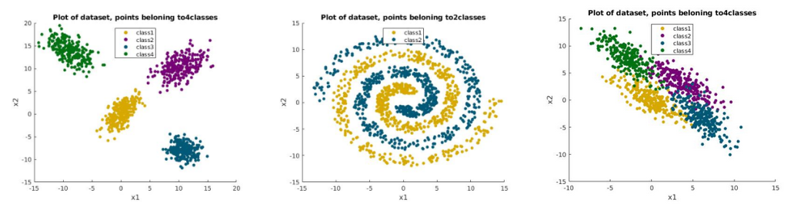

# comparing-classifiers
This project compares various classifiers: 
1. K-nearest neighbour 
2. Bayes classifier 
2. Naive Bayes classifier

for the synthetic data belonging to one of the 3 types: (i) Linearly seperable (ii) Non-linearly seperable (iii) Overlapping

Few experiments are also done on a real-world dataset, which can be a mixture of all the categories considered above. Further, prior distributions considered with the family of Bayes classifiers are gaussian and gaussian mixture model (GMM).

# Setup info
* For running the KNN classifier, simply run KNN.m
* For the GMM task on a given dataset, run gmm.m
* For the GMM task on real-world datasets, run gmm_real_world_static_data.m
* For Naive Bayes task, run Naive_Bayes.m
* RunThisFile.m  - for Bayes and Naive Bayes with Gaussian distribution. Run this in the end.

# Conclusions
Project_Report.pdf contains a detailed report about the performance analysis of the above classifiers on different datasets.

# Authors
<a href="https://github.com/madhurapande19">Madhura Pande</a>

<a href="https://github.com/AakritiBudhraja">Aakriti Budhraja</a>

<a href="https://github.com/graylevel255">Sadbhavana Babar</a>
